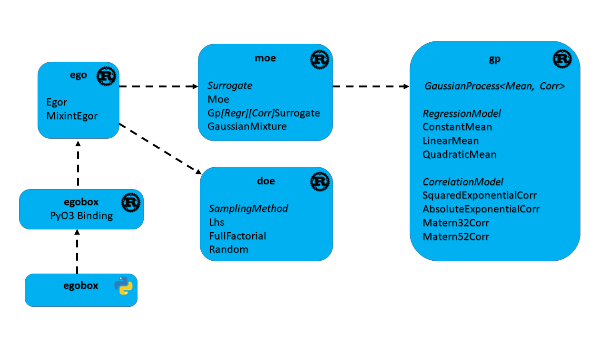

# Summary

Efficient global optimization (EGO) algorithms are used to tackle design optimization problems 
that involve computationally costly models [@Jones1998]. Basically, the idea is to use Gaussian 
process regression to approximate the objective function and use probabilistic information 
to select the promising next point where the optimum could be located.

Starting from that, one still has to tackle numerous challenges regarding the dimensionality, 
multi-modality and computation time. Different algorithms have been developed to overcome 
these hurdles [@Bartoli2019; @Dubreuil2020]. A key component of such surrogate-based algorithms 
is the existence of an implementation of Gaussian process regression also known as
kriging method [@Bouhlel2016]. 

The Surrogate Modeling Toolbox [@SMT2018; @SMT2019] library addresses such concerns using 
the Python programming language. The `egobox` library provides such key component to the Rust 
machine-learning community while focusing on adaptative global optimization.  

# Statement of need

Started by porting relevant parts from the SMT library in Rust, the `egobox` library aims 
at providing building blocks useful to implement EGO-like algorithms. This open source library 
will be used by research engineers needing to tackle design optimization problems using a 
surrogate-based adaptative approach while taking advantage of the Rust programming
language. 

Indeed research scientists reach for prototyping programming language such as Python to develop
new methods. Thanks to performant easy-to-use libraries like `numpy`, `scipy`, `scikit-learn` 
the Python language has become popular in science computing. The ability of Python
to glue together different codes explains Python ecosystem is now a de-facto open source 
standard for scientific software. Nevertheless, one might notice that the performances 
of above Python libraries relies extensively on C/Fortran compiled code. 

Thus, in the long run, a language like Python well-suited for prototyping may not be 
suitable for maintainability or performance even with a strong software development discipline.
Performance issues may arise as new algorithms are built on top of the others 
which at some point may not be tractable with such interpreted programming language.
As stated above, it is common to resort to compiled languages like C/C++ or Fortran
to implement computation-intensive methods or for embeding them in more constrained 
environments where a Python runtime does not fit.   

# Library features

With the above need in mind, the Rust programming language appears to be of interest
with its selling points being performance, reliability, and productivity.
The language is meant to challenge C as a system language but also supporting strong typing,
and high level features such as functional programming, algebric data types, and module 
management. It has a strict approach regarding memory-safety management and 
benefits from a state of the art tooling for software development. 

The Rust community has developed scientific libraries like `ndarray`, `ndarray-linalg`
which can be seen as the `numpy` and `scipy` Rust counterparts. Last but not least, 
the `linfa` project addresses the machine-learning domain with the purpose of being 
the Rust equivalent of `scikit-learn`.

The `egobox` library relies on the above thriving Rust machine learning ecosystem and 
focuses on providing some building blocks to implement efficient global optimization 
algorithms. The library is organized in four sub-packages as follows:

* `doe`: sampling methods implementing Latin Hypercube sampling, popular sampling
method used to create design of experiments,

* `gp`: Gaussian process regression also known as kriging algorithm used
as surrogate models for computationally costly black-box functions,

* `moe`: mixture of experts which aims at increasing the accuracy of a surrogate 
approximation by clustering the design space, training and selecting the best 
surrogate models on each cluster,

* `ego`: an efficient global optimization implementation with handling of inequality 
constraints and mixed integer optimization through continuous relaxation.

Finally thanks to the `PyO3` project, the Rust language is well-suited to create 
Python extensions which benefits from Rust strengths while being integrated in the 
Python ecosystem.

In order to increase the dissemination among the scientific community and demonstrate 
actual optimization capabilities based on the library, we implemented a Python module `egobox` 
as the binding of the implemented EGO-like Rust optimizer, namely `Egor`.

# Acknowledgements

I would like to thank my colleagues Nathalie Bartoli, Thierry Lefebvre, and Sylvain Dubreuil 
as their work on surrogate-based adaptative optimization has fueled this software development.

# References
